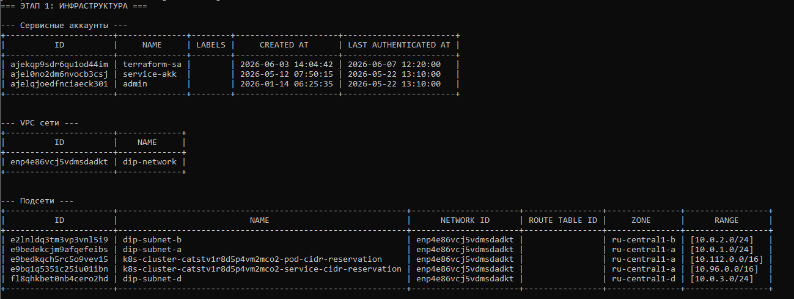
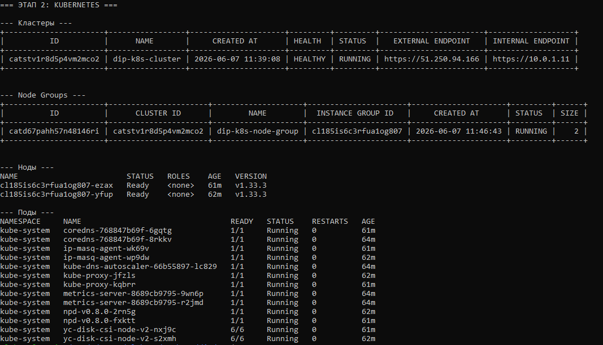
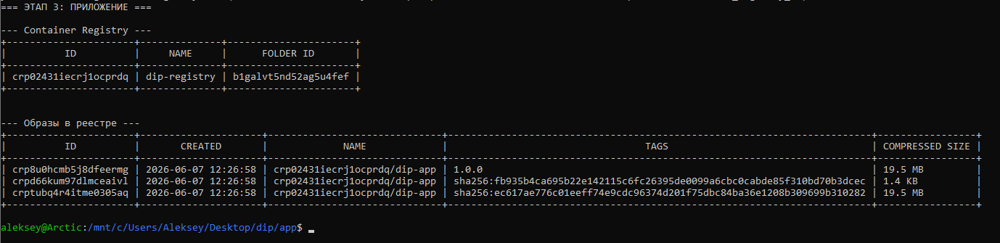
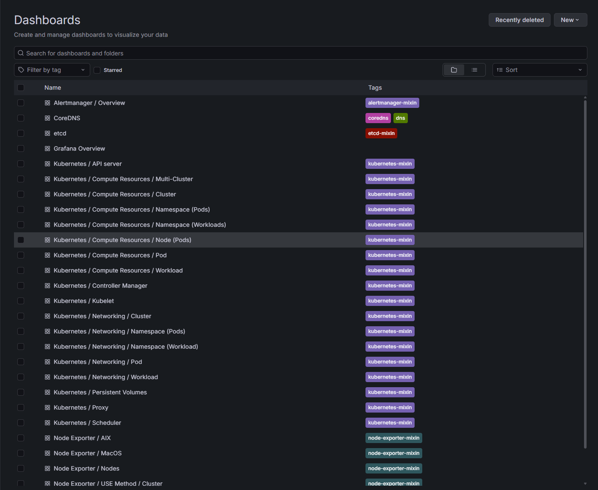
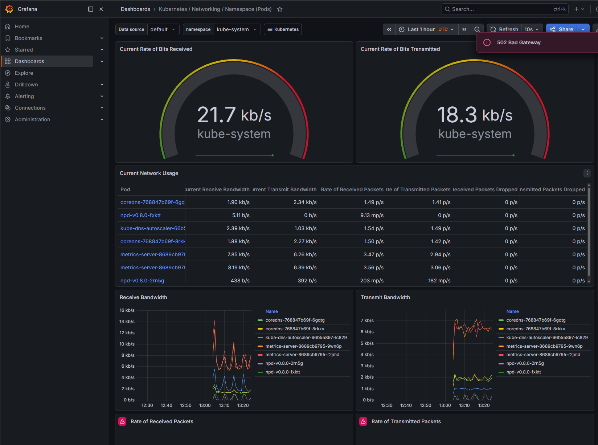
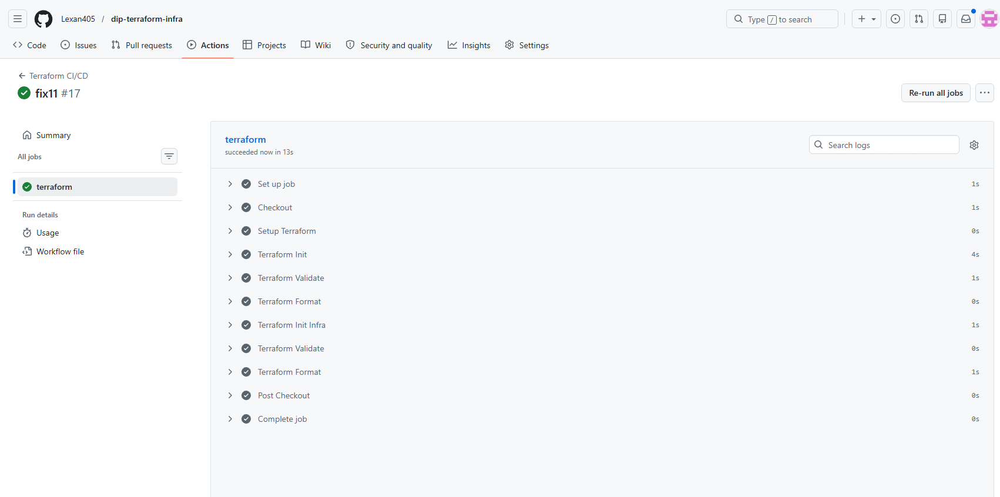
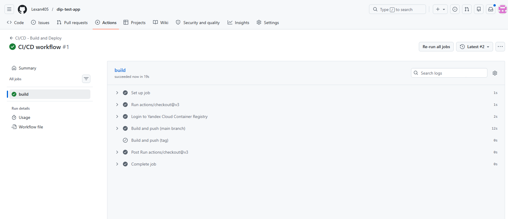
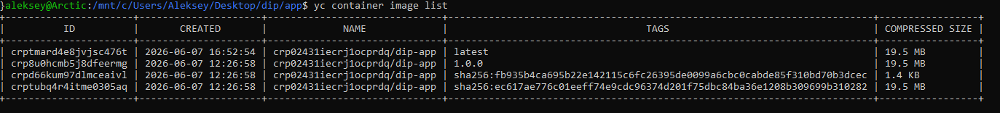

# Дипломный практикум в Yandex.Cloud

---

## Цели:
- Подготовить облачную инфраструктуру на базе облачного провайдера Яндекс.Облако.
- Запустить и сконфигурировать Kubernetes кластер.
- Установить и настроить систему мониторинга.
- Настроить и автоматизировать сборку тестового приложения с использованием Docker-контейнеров.
- Настроить CI для автоматической сборки и тестирования.
- Настроить CD для автоматического развёртывания приложения.

---

### Этап 1 и этап 2 - Создание облачной инфраструктуры и Создание Kubernetes кластера

### Развертывание IAM ресурсов

#### Инициализация Terraform

```bash
terraform init
```

#### Просмотр плана изменений

```bash
terraform plan
```

#### Применение конфигурации

```bash
terraform apply -auto-approve
```

#### Создаваемые ресурсы:
- Сервисный аккаунт terraform-sa с ролями:
  * storage.admin - управление Object Storage
  * compute.admin - управление Compute Cloud
  * vpc.admin - управление сетями
  * editor - общие права редактирования
  * iam.serviceAccounts.user - управление сервисными аккаунтами
- Статический ключ доступа (access_key + secret_key)
- S3 бакет dip-tf-state-{folder_id} для хранения Terraform state

### Развертывание основной инфраструктуры

#### Инициализация с remote backend 

```bash
terraform init -backend-config=backend.conf
```

- Флаг -backend-config=backend.conf передает в этот блок конкретные параметры из файла. Это позволяет не хранить чувствительные данные или специфичные для окружения настройки (имена бакетов, регионы) прямо в коде, который лежит в Git.
Использование -backend-config вместо жесткого прописывания настроек в .tf файлах дает два главных преимущества:
- Безопасность: Файл backend.conf можно добавить в .gitignore, чтобы не коммитить названия внутренних бакетов или специфичные пути в публичный репозиторий.
- Переиспользование кода: можно иметь файлы backend-dev.conf и backend-prod.conf. Запуская terraform init -backend-config=backend-dev.conf, развертывается инфраструктура в dev-окружении, а с backend-prod.conf — в продакшене, используя один и тот же код .tf файлов.
#### Просмотр плана 

```bash
terraform plan
```

#### Применение конфигурации

```bash
terraform apply -auto-approve
```

#### Создаваемые ресурсы:
- VPC сеть dip-network
- 3 подсети в зонах ru-central1-a, ru-central1-b, ru-central1-d
- Managed Kubernetes кластер dip-k8s-cluster (zonal, public IP)
- Node group dip-k8s-node-group (standard-v3, preemptible, 2 ноды)
- Container Registry dip-registry

### Ссылка на репозитории:

- https://github.com/Lexan405/dip-terraform-infra

### Инфраструктура:





---

### Этап 3 - Создание тестового приложения

### Сборка и Push образа в Container Registry

#### Авторизация в Yandex Container Registry 

```bash
docker login cr.yandex --username oauth --password $(yc iam create-token)
```

#### Сборка Docker образа 

```bash
docker build -t cr.yandex/$REGISTRY_ID/dip-app:1.0.0 .
```

#### Отправка образа в регистр (Push)

```bash
docker push cr.yandex/$REGISTRY_ID/dip-app:1.0.0
```

### Ссылка на репозитории:

- https://github.com/Lexan405/dip-test-app

### Добавленное приложение в Container Registry:



---

### Этап 4 - Подготовка системы мониторинга и деплой приложения

#### Добавление репозиториев

```bash
helm repo add prometheus-community https://prometheus-community.github.io/helm-charts
helm repo add ingress-nginx https://kubernetes.github.io/ingress-nginx
helm repo update
```

#### Создание namespace

```bash
kubectl create namespace monitoring
kubectl create namespace ingress-nginx
```

#### Установка Ingress Controller

```bash
helm install ingress-nginx ingress-nginx/ingress-nginx \
  --namespace ingress-nginx \
  --set controller.replicaCount=1 \
  --set controller.resources.requests.cpu=50m \
  --set controller.resources.requests.memory=64Mi
```

#### Установка kube-prometheus-stack

```bash
helm install prometheus prometheus-community/kube-prometheus-stack \
  --namespace monitoring \
  --values /mnt/c/Users/Aleksey/Desktop/dip/k8s-manifests/monitoring/values.yaml
```

#### Деплой приложения и Ingress в Kubernetes

```bash
kubectl apply -f /mnt/c/Users/Aleksey/Desktop/dip/k8s-manifests/app/
kubectl apply -f /mnt/c/Users/Aleksey/Desktop/dip/k8s-manifests/ingress/
```

#### Получение IP Ingress Controller

```bash
kubectl get svc -n ingress-nginx
INGRESS_IP=$(kubectl get svc ingress-nginx-controller -n ingress-nginx -o jsonpath='{.status.loadBalancer.ingress[0].ip}')
echo "Ingress IP: $INGRESS_IP"
```

#### Добавление IP в файл hosts (если работа через WSL терминал)

* <INGRESS_IP>  <IP-адреес> app.dip.local
* <INGRESS_IP>  <IP-адреес> grafana.dip.local

### Ссылка на репозитории:

- https://github.com/Lexan405/dip-k8s-manifests

### Мониторинг:





### Деплой инфраструктуры:



### Длоступ к приложению:


---

### Этап 5 - Установка и настройка CI/CD

#### GitHub Actions

1. Моздание конфигураций для деплоя
- terraform.yml  # CI/CD для Terraform
- ci-cd.yml   # CI/CD для app

2. Настройка секретов:
- YC_SA_KEY
- TF_STATE_BUCKET
- TF_STATE_ACCESS_KEY
- TF_STATE_SECRET_KEY

### Деплой приложения:



### Проверка деплоя в Container Registry:

